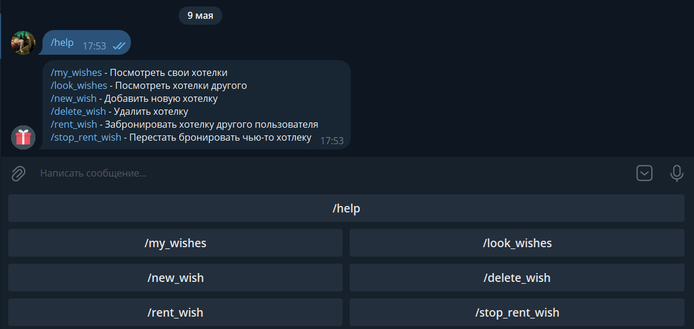
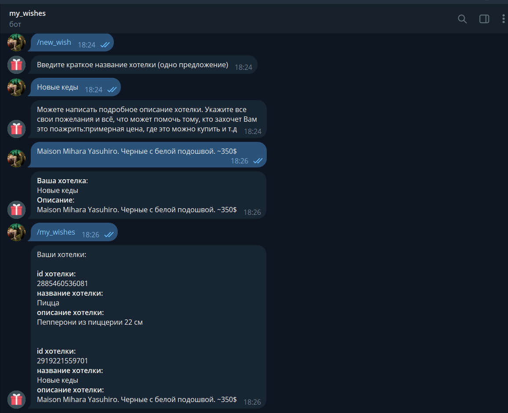
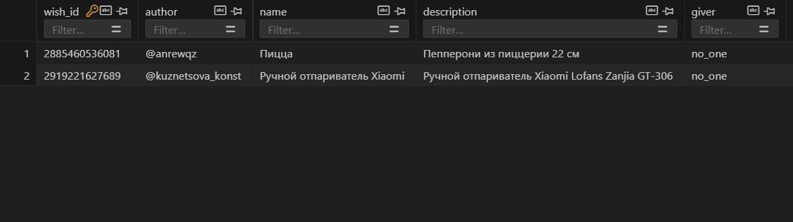

## My wishes telegram bot ## 
### Кузнецов Андрей Б05-323 ###

Бот, с помощью которого, можно записывать, какие подарки ты хочешь получить, а также смотреть, что хотят получить твои друзья. 

Пользователь может добавлять новые желания, смотреть желания других пользователей, а также бронировать подарки друзей
(другие пользователи будут видеть, что этот подарок дарите Вы, а автор самого желания не будет знать какие из его желаний забронированны). 

**(Больше скриншотов в папке docs)**

Бот написан с помощью библиотеки **AIOGram**

Данные о желаниях пользователей будут храниться на локальной базе данных, написанной с помощью библиотеки **SQLite**.

Архитектура:    
Папка src:  
**run.py** - файл, при запуске которого, запускается бот  
**handlers.py** - файл, в котором прописаны действия бота, в зависимости от сообщений пользователя  
**sqlite.py** - файл, в котором написано, как бот обращается к базе данных.  
**config.py** - файл, в котором записан токен бота.  
**wishes.db** - файл с базой данных
